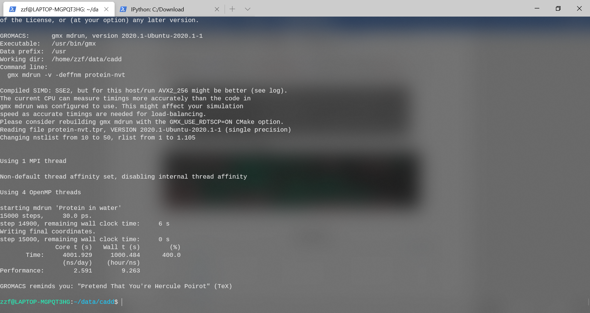

## 实验过程

### 2.1 体系准备

#### 2.1.1 丢失残基、丢失原子与杂原子检查

本次实验采用MODELLER建模结果，在实验数据上无丢失残基、丢失原子与杂原子。

#### 2.1.2 结构质量

通过上一次实验，经过MOLPROBILITY、SAVES的检测，选定多模板建模的MODEL1作为本次实验材料，命名为protein.pdb。

### 2.2 结构文件转换与拓扑文件生成

分子是由原子的坐标以及键与非键相互作用的描述来定义的。由于PDB得到的结构只包含坐标，我们首先要构造拓扑结构，它从原子类型、电荷、键等方面描述系统，这种拓扑结构是特定于某个力场的，要使用的力场是需要仔细考虑的问题之一。

重要的是，拓扑结构文件要与结构文件匹配，这意味着结构文件也需要转换，以遵守使用的力场。

为了转换结构和构造拓扑结构，可以使用`pdb2gmx`程序。这个程序的目的是为由不同的构建块组成的分子（如氨基酸）构建拓扑结构。它使用一个构建基块库来进行转换，并且无法识别库中不存在的分子或残留物。发出以下命令以转换结构；在提示时选择AMBER99SB力场和TIP3P水模型。`-ignh`会使得文件中的氢原子被移除，并根据力场中的描述进行重建。

```bash
gmx pdb2gmx -f protein.pdb -o protein.gro -p protein.top -ignh
```


可以看到，转换后：

-   5331个原子(原2711)

-   具有7个正电荷

得到指定文件名的坐标文件protein.gro与拓扑结构文件protein.top,同时自动生成porse.itp文件


关于文件类型:

-   分子和系统的定义（存在多少类型的分子）位于带有`.top`扩展名的文件中,即拓扑结构文件

-   为了提高可读性，该`.top`文件可以引用其他带有扩展名的信息的文件，如`.itp`。通常`.itp`文件包含交互作用的说明（即力场）

-   除了有关分子及其相互作用的信息外，运行还需要起始坐标。这些可以以不同的格式提供，例如从数据库下载的PDB格式或其他格式。大多数时候，我们将使用PDB和内部GROMACS格式。内部GROMACS文件名的扩展名是`.gro`

-   最后，运行需要知道必须执行多少个MD步骤，应该使用什么温度和压力等。所有这些信息（“运行时变量”）都在所谓的mdp文件中指定，扩展名为`.mdp`

### 2.3 周期边界条件

在添加溶剂之前，必须选择模拟设置的总体布局（空间）。最常见的模拟是在周期性边界条件（PBC）下执行的，这意味着定义了一个单位晶胞，该晶胞可以以空间填充的方式堆叠。这样，可以模拟无限的周期性系统，避免了由于模拟体积的壁而产生的边缘效应。仅少数几种通用形状可用于设置PBC。我们将使用cubic。为了禁止周期性图像之间的直接相互作用，我们将蛋白质和细胞壁之间的最小距离设置为1.0
nm，这样，没有两个邻居会比2.0
nm更近;-c使得蛋白质位于盒子中心。使用**editconf**设置周期性边界条件：

```bash
gmx editconf -f protein.gro -o protein-PBC.gro -c -d 1.0 -bt cubic
```

查看editconf的输出，并注意volume中的变化。


单元体积从224.599nm\^3增加为825.05nm\^3。

另外，查看protein-PBC.gro文件的最后一行：

```bash
tail -1 protein-PBC.gro
```


在gromacs格式（.gro）中，最后一行指定单元形状。它总是使用三线性矩阵表示，前三个数字指定对角线元素（xx，yy，zz），后六个数字指定非对角线元素（xy，xz，yx，yz，zx，zy）。

**附不同盒子的比较:**


```bash
gmx editconf -f protein.gro -o protein-triclinic.gro -d 1.0 -bt
triclinic

gmx editconf -f protein.gro -o protein-dodecahedron.gro -d 1.0 -bt
dodecahedron
```

triclinic:单元体积从224.599nm\^3增加为528.17nm\^3

dodecahedron: 单元体积从224.599nm\^3增加为583.40nm\^3

都比cubic紧凑。

### 2.4 溶剂添加

现在，unit cell已经建立，溶剂可以添加。有几种溶剂模型，每种模型或多或少都与力场紧密相连。索环力场通常用于简单点电荷（SPC）水模型。溶剂生成不需要拓扑结构，但可以更新拓扑结构以包含添加的溶剂。要用SPC填充单位单元格，使用以下命令：

```bash
gmx solvate -cp protein-PBC.gro -cs spc216.gro -p protein.top -o
protein-water.pdb
```


查看protein.top文件的末尾以查看添加情况。


可以看到，系统中加入了24899个水分子。

在VMD中加载溶剂化结构（protein-water.pdb），在启动VMD的终端中键入以下内容：

```bash
pbc box
```


**附不同盒子的比较:**

```bash
gmx solvate -cp protein-triclinic.gro -cs spc216.gro -p
protein-triclinic.top -o protein-water-triclinic.pdb

gmx solvate -cp protein-dodecahedron.gro -cs spc216.gro -p
protein-dodecahedron.top -o protein-water-dodecahedron.pdb
```


* triclinic: 系统中加入了15531个水分子
* dodecahedron: 系统中加入了17168个水分子


### 2.5 离子的添加​​：反电荷和浓度

此时，我们有一个溶剂化的蛋白质，但是系统的净电荷仍然存在。为了使系统中性，我们必须添加许多抗衡离子。另外，将离子添加到一定浓度可能被认为是一种很好的做法。**genion**可以处理这两个任务，但是需要一个运行输入文件作为输入，即同时包含结构和拓扑的文件。可以使用**grompp**生成这样的文件：

```bash
gmx grompp -v -f ions.mdp -c protein-water.pdb -p protein.top -o
protein-water.tpr
```

要执行这些步骤，首先将参数文件ions.mdp设置好。(注:仅用来生成tpr文件，未进行mdrun)*该文件包含用于最小化能量的控制参数。以“integrator”开头的行，该行指定要使用的算法，此时采用steep法，即最速下降法;emtol是认定收敛的Fmax大小(当最大作用力小于此值，认为最小化过程收敛)，设为500.0kJ/mol/nm；步长0.01，最大执行10000步；邻居更新频率设为1；查找邻居算法采用Verlet算法。*


随后，protein-water.tpr文件可以用作genion的输入。指定要添加的NA+/CL-（-pname
NA-nname
CL），并指出必须添加过量的一种离子来中和系统（-neutral）。genion将要求用一组分子来部分替换离子。应选择组“SOL”。从列表中键入与此组对应的号码，然后按“回车”。执行此操作之前，复制不带离子的拓扑文件：

```bash
cp protein.top protein-water.top

gmx genion -s protein-water.tpr -o protein-solvated.gro -conc 0.15
-neutral -pname NA -nname CL -p protein.top
```


通过回显可以看到，添加了7个CL。

用离子代替了不少水分子后，protein.top中的系统拓扑发生了变化。比较文件protein-water.top和protein.top的最后几行，并检查差异是否反映了genion程序刚刚执行的操作。


可以注意到，系统中确实添加了0个NA和7个CL离子。

在这个阶段，我们有了一个在溶剂（水）和离子多肽的开始结构，让系统为模拟做好准备。

### 2.6 结构的能量最小化

现在，将针对所选的力场以及相应的拓扑以正确的格式生成结构。实际上，这是一个模拟步骤，涉及两个过程。首先，将结构和拓扑与多个控制参数一起组合成对系统的单个描述。这将产生一个运行输入文件(.tpr)，该文件可用作模拟程序**mdrun**的单个输入。


要执行这些步骤，首先将参数文件minim.mdp设置好。该文件包含用于最小化能量的控制参数。以“
integrator”开头的行，该行指定要使用的算法，此时采用steep法，即最速下降法;emtol是认定收敛的Fmax大小(当最大作用力小于此值，认为最小化过程收敛)，设为500.0kJ/mol/nm；步长0.01，最大执行10000步；邻居更新频率设为1；查找邻居算法采用Verlet算法。

现在，使用**grompp**组合结构，拓扑和控制参数：

```bash
gmx grompp -f minim.mdp -c protein-solvated.gro -p protein.top -o
protein-EM.tpr
```


该程序还生成一个附加的输出文件，其中包含所有控制参数（mdout.mdp）的设置。

接着开始`mdrun`：

```bash
gmx mdrun -v -s protein-EM.tpr -deffnm protein-EM-solvated -c
protein-EM-solvated.pdb
```

`-v`标志使势能和最大作用力在每个步骤中被打印，可以跟踪最小化的进行。


采用VMD可视化:

```bash
vmd protein-EM-solvated.pdb
```

可以看看势能发生什么变化。模拟中的能量信息以不可读（二进制）文件格式存储，扩展名为`.edr`。可以使用gromacs工具`gmx energy`提取此文件中的信息。接下来，提取的信息可以显示为图或图。开始提取势能：

```bash
gmx energy -f protein-EM-solvated.edr -o potential-energy-EM.xvg
```


采用如下python脚本进行可视化:

```py
import pandas as pd
import matplotlib.pyplot as plt
import seaborn as sns; sns.set_style('whitegrid')

df = pd.read_csv('potential-energy-EM.xvg', sep=' ', skiprows=24, header=None, engine='python')
plt.title('Energy Minimization\nSteepest Descent')
plt.xlabel('Step');plt.ylabel('Potential Energy (kJ/mol)')
plt.plot(df[0],df[1], label='Potential');plt.legend();plt.show()
```


### 2.7 平衡体系

#### 2.7.1 NVT平衡（温度）

能量最小化确保我们在几何形状和溶剂取向方面具有合理的起始结构。要开始真正的动力学，我们必须平衡蛋白质周围的溶剂和离子。如果我们此时尝试不受限制的动力学，系统可能会崩溃。原因是溶剂大部分在自身内部进行了优化，而不一定需要使用溶质。需要将其加热到我们希望模拟并建立关于溶质（蛋白质）正确取向的温度。在达到正确的温度（基于动能）之后，我们将向系统施加压力，直到达到适当的密度。

平衡通常分两个阶段进行。第一阶段是在NVT集成下进行的（恒定的粒子数，体积和温度）。该集成也称为“等温-等速”或“规范(canonical)”。此过程的时间范围取决于系统的内容，但在NVT中，系统的温度应达到所需值的平稳状态。如果温度尚未稳定，则需要更多时间。按实验要求进行30
ps的NVT平衡。

nvt.mdp文件参数设置如下:

-   integrator = md：采用蛙跳法

-   nsteps = 15000

-   Dt = 0.002 （2fs\*15000=30ps）

-   n\_vel = yes：启动速度生成。使用不同的随机种子（gen\_seed）会给出不同的初始速度，因此可以从相同的起始结构进行多个（不同的）模拟。

-   tcoupl = V-rescale：速度重定标恒温器是对Berendsen弱耦合方法的改进，该方法没有重现正确的动力学集合。

-   pcoupl = no：不使用压力耦合。

-   tc-grps = Protein Non-Protein: 分为两组，蛋白与非蛋白

-   ref_t = 300 300: 设置升温至300K(两组皆是)


```bash
gmx grompp -f nvt.mdp -c protein-EM-solvated.pdb -r
protein-EM-solvated.pdb -p protein.top -o protein-nvt.tpr
```


```bash
gmx mdrun -v -deffnm protein-nvt
```



```bash
gmx energy -f protein-nvt.edr -o temperature.xvg
```


采用如下python脚本进行可视化:

```py
df = pd.read_csv('temperature.xvg', sep=' ', skiprows=24, header=None, engine='python')
plt.title('Temperature\nNVT Equilibration')
plt.xlabel('Time (ps)');plt.ylabel('Temperature (K)')
plt.plot(df[0],df[1]);plt.show()
```


从图中可以看出，系统温度迅速达到目标值（300
K），并且在其余的平衡过程中基本保持稳定。对于该系统，本次进行的30ps较短的平衡周期是足够的。

#### 2.7.2 NPT平衡 （压力）

上一步NVT平衡可稳定系统温度。在收集数据之前，我们还需要稳定系统的压力（以及密度）。压力平衡是在NPT整体下进行的，其中颗粒数，压力和温度均恒定。该集成也称为“等温-等压”集成，与实验条件最相似。

本次实验暂不进行。

### 2.8 动力学模拟采样

#### 2.8.1 模拟采样

平衡阶段完成后，系统在所需的温度（和压力）下完全平衡。我们现在准备释放位置限制，并运行动力学模拟采样。这个过程和我们之前看到的一样，因为我们将使用检查点文件（在本例中现在包含保留压力耦合信息）到**grompp**。将运行模拟时间1ns，步长2fs的
MD模拟；同时每10ps保存一帧。`md.mdp`参数文件内容如下:


```bash
gmx grompp -f md.mdp -c protein-nvt.gro -t protein-nvt.cpt -p protein.top -o md_0_1.tpr
```


对于立方盒（cubic），最佳设置的PME负载为0.25,上图显示的估计值为0.16，说明离最佳值有一定距离。下面开始进行模拟:

```bash
nohup gmx mdrun -deffnm md_0_1 -v > md_0_1_sample.out &
```

由于设备存储限制，程序在进行到200ps时终止。

#### 2.8.2 结果分析

现在我们已经模拟了蛋白质，我们应该在系统上进行一些分析。**trjconv**用于去除坐标、校正周期性或手动改变轨迹（时间单位、帧频率等）。蛋白质可能出现“破碎”或“跳跃”到盒子的另一边。通过下列命令解决此情况:

```bash
gmx trjconv -s md_0_1.tpr -f md_0_1.xtc -o md_0_1_noPBC.xtc -pbc mol -center
```

选择1 ("Protein") 作为 居中的group ，选择 0 ("System")
作为输出。为最小二乘拟合和RMSD计算组选择3（“C-alpha”）。-tu标志将以ns为单位输出结果。

```bash
gmx rms -s md_0_1.tpr -f md_0_1_noPBC.xtc -o rmsd.xvg -tu ns
```

通过以下脚本进行可视化:

```py
df = pd.read_csv('rmsd.xvg', sep=' ', skiprows=18, header=None, engine='python')
plt.title('RMSD\nC-alpha')
plt.xlabel('Time (ns)');plt.ylabel('RMSD (nm)')
plt.plot(df[0],df[2]);plt.show()
```


可以看到即便在200ps内，以C-alpha来计算的RMSD也较快就集中在0.15-0.2之间，表明结构比较稳定。

下面计算C-alpha的均方根涨落(RMSF):

```bash
gmx rmsf -smd_0_1.tpr -fmd_0_1_noPBC.xtc -o rmsf.xvg
```

通过一下脚本进行可视化:

```py
df = pd.read_csv('rmsf.xvg', sep=' ', skiprows=17, header=None,
engine='python')
plt.title('RMSF\nC-alpha')
plt.xlabel('Time');plt.ylabel('RMSF')
plt.plot(df[0],df[1]);plt.show()
```


均方根涨落（RMSF）计算每个原子相对于其平均位置的涨落,
表征了结构的变化对时间的平均, 给出了蛋白各个区域柔性的表征,
对应于晶体学中的b-factor。 可以看到RMSF和与b-factor相似,
表明模拟结果与晶体结构具有符合性。

接下来查看体系总体势能的变化情况:

```bash
gmx energy -fmd_0_1.edr -omd_0_1_potential.xvg
```


可以看到，总体上势能是下降的，趋于稳定。

下面分析蛋白质的回旋半径变化，蛋白质的回转半径是其紧密度的量度。如果蛋白质被稳定折叠，它将可能保持相对稳定的Rg值。如果蛋白质解折叠，其Rg将随时间变化。

```bash
gmx gyrate -smd_0_1.tpr -fmd_0_1_noPBC.xtc -o gyrate.xvg
```

选择 group 1 (Protein) 进行分析,通过以下脚本进行可视化:

```py
df = pd.read_csv('gyrate.xvg', sep=' ', skiprows=27, header=None,
engine='python')
plt.title('Radius of gyration (total and around axes)')
plt.xlabel('Time (ps)');plt.ylabel('Rg (nm)')
plt.plot(df[0],df[1]);plt.show()
```


可以看到，回旋半径还是存在一定变化，但总体上是稳定的，这表明蛋白质在300
K下1 ns的过程中以紧密（折叠）形式保持非常稳定的状态。

下面利用`trjconv`生成用于展示的pdb文件:

```bash
gmx trjconv -smd_0_1.tpr -fmd_0_1_noPBC.xtc -o movie.pdb
```


采用chimera可视化可以看到，二级结构无较大变化,三级结构总体稳定。进一步将(movie.pdb文件中)采样的各个构象互相之间进行结构比对，得到如下RMSD
Map:


接着利用chimera制作MD Movie:


<iframe src="//player.bilibili.com/player.html?aid=583014271&amp;bvid=BV1Jz4y1R77p&amp;cid=189132433&amp;page=1" frameborder="no" scrolling="no" width="95%" height="600"> </iframe>

## 参考资料

1. http://www.mdtutorials.com/gmx/lysozyme
2. http://cgmartini.nl/~mdcourse/pepmd/md.html
