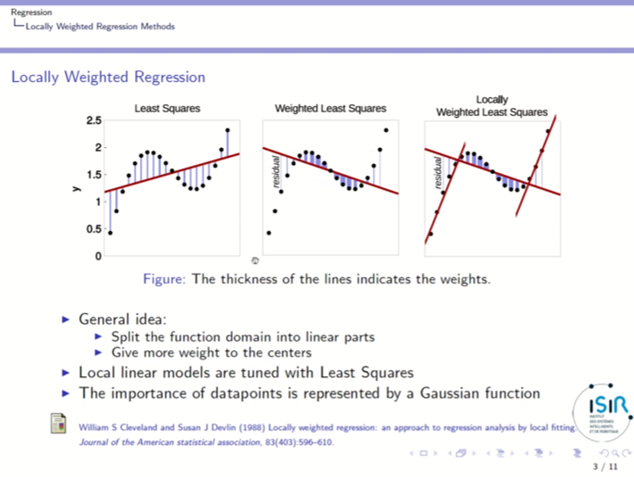
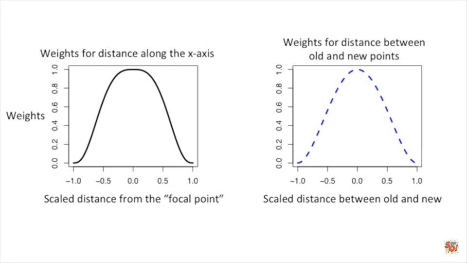
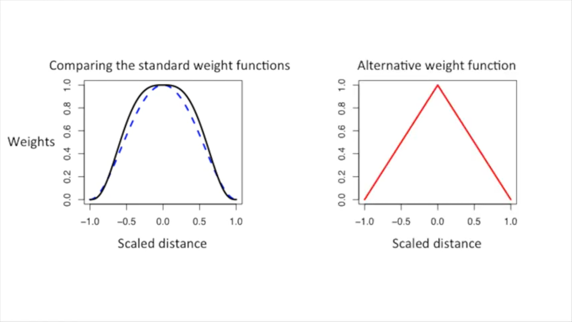

## Basic Information

> Local regression or local polynomial regression, also known as moving regression, is a generalization of moving average and polynomial regression. Its most common methods, initially developed for scatterplot smoothing, are LOESS (locally estimated scatterplot smoothing) and LOWESS (locally weighted scatterplot smoothing). ***From wikipedia***

## Introduction

* _Least Squares_ finds the line with the minimal squared distance from the data points.
* But how to fit a curve to data?
* LOWESS Smmothing use least squares to do it.



## Idea

* Use a type of sliding window to diveide the data into smaller blobs
* At each data point, use a type of least squares(weighted) to fit a line
* To reduce the influence on the new curve, we create an additional _weight_ for the weighted least squares based on how far the original point is from the new point
* Iter

## Weight Functions

<table>
    <tr>
        <td>
            Different weight functions
        </td>
        <td>
          Comparison of weight functions
        </td>
    </tr>
    <tr>
        <td>
            
        </td>
        <td>
            
        </td>
    </tr>
</table>

## Code Example

> https://github.com/StatQuest/lowess_loess_demo/blob/master/lowess_loess_demo.R

```R
## first let's make a noisy gamma distribution plot...
x <- seq(from=0, to=20, by=0.1)
y.gamma <- dgamma(x, shape=2, scale=2)
y.gamma.scaled <- y.gamma * 100
 
y.norm <- vector(length=201)
for (i in 1:201) {
  y.norm[i] <- rnorm(n=1, mean=y.gamma.scaled[i], sd=2) 
}
 
data <- data.frame(x, y.norm)
 
plot(data, frame.plot=FALSE, xlab="", ylab="", col="#d95f0e", lwd=1.5)
 
## Now that we have the data, let's look at the differences 
## and similarities between R's lowess() function and the loess() function.
 
## We'll start with the lowess() function...
##
## By default "lowess()" fits a line in each window using
## 2/3's of the data points.
##
## the first parameter, y.norm ~ x, says that y.norm is being
## modeled by x, and the second parameter, f, is the fraction
## of points to use in each window. Here, we're using 1/5 of the
## data points in each window.
lo.fit.gamma <- lowess(y.norm ~ x, f=1/5)
 
plot(data, frame.plot=FALSE, xlab="", ylab="", col="#d95f0e", lwd=1.5)
lines(x, lo.fit.gamma$y, col="black", lwd=3)
 
## Now use loess() to fit a curve to the data...
##
## By default "loess()" fits a parabola in each window using
## 75% of the data points.
plx<-predict(loess(y.norm ~ x, span=1/5, degree=2, family="symmetric", iterations=4), se=T)
 
plot(data, frame.plot=FALSE, xlab="", ylab="", col="#d95f0e", lwd=1.5)
lines(x, plx$fit, col="black", lwd=3)
 
## Now let's add a confidence interval to the loess() fit...
plot(data, type="n", frame.plot=FALSE, xlab="", ylab="", col="#d95f0e", lwd=1.5)
polygon(c(x, rev(x)), c(plx$fit + qt(0.975,plx$df)*plx$se, rev(plx$fit - qt(0.975,plx$df)*plx$se)), col="#99999977")
points(data, col="#d95f0e", lwd=1.5)
lines(x, plx$fit, col="black", lwd=3)
 
## Now that we know how those functions work... we can skip all that
## nasty stuff and just use ggplot2 with geom_point() and geom_smooth()
library(ggplot2)
ggplot(data=data, aes(x=x, y=y.norm)) +
  geom_point() +
  geom_smooth(span=1/5)
```

## Reference

1. [📜Wikipedia Local regression](https://en.wikipedia.org/wiki/Local_regression)
2. [📺StatQuest: Fiitting a curve to data, aka lowess, aka loess](https://www.youtube.com/watch?v=Vf7oJ6z2LCc)
3. [📺Locally Weighted Regression](https://www.youtube.com/watch?v=TzjGoHb4ecY)