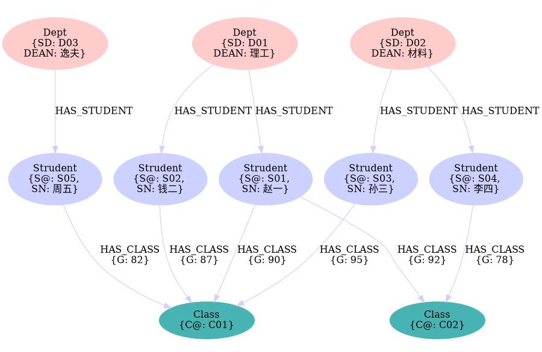

# Functional dependency

## Definition

* 关系模式简化三元组$R<U,F>$
  * 关系(Set of Tuple): $R$
  * 属性集(Set of Property): $U$
  * 函数依赖: $F$
* (Set of Property): $X, Y \subseteq U$
  * X is a Set
  * Y is a Set
* 关系模式(Model): $R(U)$
* (Set of Tuple): $r$
  * r的属性集是U的子集
  * r中Tuple数量和R(U)中一致
  * 专有名词:
* (Tuple): $\forall t,s \in r$
* (Set/Tuple of values of the assigned Property Set): $t[X], s[X], t[Y], s[Y]$
* 如果成立$\forall t,s \in r,\,\text{if}\,\,\, t[X]=s[X]\,\,\,\text{then}\,\,\,t[Y]=s[Y]$，那么有$X\rightarrow Y$
  * X _函数决定_ Y
  * Y _函数依赖_ 于 X
  * X为决定因素 

## Trivial function dependency

$\text{if}\,\,\, X\rightarrow Y\,\,\And \,\, Y\subset X\,\,\, \text{then}\,\,\,\text{Trivial function dependency}$

## Non-trivial function dependency

$\text{if}\,\,\, X\rightarrow Y\,\,\And \,\, Y\not\subset X\,\,\, \text{then}\,\,\,\text{Non-trivial function dependency}$

## Partial/Full function dependency

...

## Transfer function dependency

$X\rightarrow Y \And Y \not\rightarrow X \And Y\rightarrow Z$

## Example

* $S@ \rightarrow^{f}SD$
* $S@\rightarrow^{f}SN$
* $SD\rightarrow^{f}DEAN$
* $(S@,C@)\rightarrow^{f}G$

## Key

* 超键$K \rightarrow U$
* 候选键 $K \rightarrow^{f} U$
* 主键
  * 标识元组唯一性
* 全键

## Normol Form

### 1NF

* 关系模式R中所有属性都是不可分的基本数据项，即不能以集合、序列作为属性值
* 1NF是关系模式最起码的要求
* 若$R\not\in 1NF$，则R不是关系数据库

S@|SN|SD|DEAN|C@|G
-|-|-|-|-|-
S01|赵一|D01|理工|C01|90
S02|钱二|D01|理工|C01|87
S01|赵一|D01|理工|C02|92
S03|孙三|D02|材料|C01|95
S04|李四|D02|材料|C02|78
S05|周五|D03|逸夫|C01|82

$S(S@,SN,SD,DEAN,C@,C)$:

* $(S@,C@)\rightarrow^{p}SD$
* $(S@,C@)\rightarrow^{p}SN$
* $(S@,C@)\rightarrow^{p}DEAN$
* $(S@,C@)\rightarrow^{f}G$

### 2NF

* 在1NF的基础上，非码属性必须完全依赖于候选码
* 在1NF基础上消除非主属性对主码的部分函数依赖

把S这一表分解为两个表:

$SC(S@,C@,G)$: 
* $(S@,C@)\rightarrow^{f}G$

S@|C@|G
-|-|-
S01|C01|90
S02|C01|87
S01|C02|92
S03|C01|95
S04|C02|78
S05|C01|82

$S\_SD(S@, SN, SD, DEAN)$:
* $S@\rightarrow^{f}SD$
* $S@\rightarrow^{f}SN$
* $S@\rightarrow^{f}DEAN$

S@|SN|SD|DEAN
-|-|-|-|-
S01|赵一|D01|理工
S02|钱二|D01|理工
S01|赵一|D01|理工
S03|孙三|D02|材料
S04|李四|D02|材料
S05|周五|D03|逸夫

### 3NF

* (1NF->2NF)在1NF基础上，消除非主属性对主码的部分函数依赖
*  (2NF->3NF)在2NF基础上消除非主属性对键的传递函数依赖
* 从一个表中删去不依赖与主键的数据

S_SD表中存在传递依赖，因此再继续把S_SE表分解为两个表

$\text{STUDENT}(S@,SN,SD)$:
* $S@\rightarrow^{f}SD$
* $S@\rightarrow^{f}SN$

S@|SN|SD
-|-|-
S01|赵一|D01
S02|钱二|D01
S01|赵一|D01
S03|孙三|D02
S04|李四|D02
S05|周五|D03

$\text{DEPT}(SD,DEAN)$:
* $SD\rightarrow^{f}DEAN$

SD|DEAN
-|-
D01|理工
D02|材料
D03|逸夫

## GraphDB

### Design

#### Relational to Graph

* foreign key to edge
* table without primary key(joint table) to edge with properties
* table with primary key to node

 

custom_mark10
digraph graphDB {
	size="6,4"; ratio = fill;
  edge [color="0.700 0.200 1.000"];
	node [style=filled];
  Dept[label="Dept\n{SD: unique value\nDEAN: value}", color="0.0 0.200 1.000"];
  Student[label="Strudent\n{S@:unique value, \nSN: value}", color="0.650 0.200 1.000"];
  Class[label="Class\n{C@: unique value}", color="0.50 0.60 0.700"];
  Dept -> Student[label="HAS_STUDENT"];
  Student -> Class[label="HAS_CLASS\n{G: value}"];
}
custom_mark10

### Show Data

