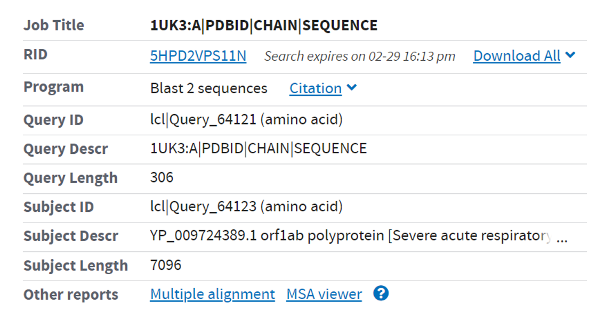
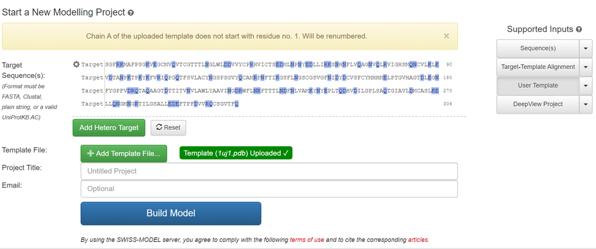

<script src="../../build/ngl.js"></script>
  <script>
    document.addEventListener("DOMContentLoaded", function () {
      var stage_modeller = new NGL.Stage("viewport_modeller");
      var stage_swissModel = new NGL.Stage("viewport_swissModel");
      var stage_superImpose_raw = new NGL.Stage("viewport_superImpose_raw");
      var stage_superImpose_swissModel = new NGL.Stage("viewport_superImpose_swissModel");
      stage_modeller.loadFile("../../assets/data/YP_009724389_1UK3A.B99990001.pdb", {defaultRepresentation: true});
      stage_swissModel.loadFile("../../assets/data/YP_009724389_1UK3A.SWISS-MODEL.pdb", {defaultRepresentation: true});
      stage_superImpose_raw.loadFile("../../assets/data/6lu7A.1uj1A.pdb", {defaultRepresentation: true});
      stage_superImpose_swissModel.loadFile("../../assets/data/6lu7A.pdb.SWISS-MODEL.pdb", {defaultRepresentation: true});
      stage_modeller.spinAnimation.axis.set(0, 1, 0);
      stage_swissModel.spinAnimation.axis.set(0, 1, 0);
      stage_superImpose_raw.spinAnimation.axis.set(0, 1, 0);
      stage_superImpose_swissModel.spinAnimation.axis.set(0, 1, 0);
      stage_modeller.setSpin(true);
      stage_swissModel.setSpin(true);
      stage_superImpose_raw.setSpin(true);
      stage_superImpose_swissModel.setSpin(true);
    });
  </script>

# Task 1 of Proteomics Informatics

_28 Feb 2020 1730416009 朱泽峰_

## Requirement

复现文章

> Potential inhibitors for 2019-nCoV coronavirus M protease From clinically approved medicines *Xin Liu, Xiu-Jie Wang*

## Material

### Sequence Resource

> The protein sequences of SARS-CoV Mpro (Accession: 1UK3_A) and 2019-nCoV polyprotein orf1ab (Accession: YP_009724389.1) were downloaded from GenBank(http://www.ncbi.nlm.nih.gov). *The protein sequence of 2019-nCoV Mpro was determined by aligning the SARS-CoV Mpro sequence to 2019-nCoV polyprotein orf1ab using BLAST (Altschul et al., 1990)*, the best aligned region in 2019-nCoV orf1ab to SARS-CoV Mpro was selected as 2019-nCoV Mpro.

### Structure Modeling

> Crystal structure of SARS-CoV Mpro (PDB ID: 1UJ1) was downloaded from Protein Data Bank (PDB, http://www.rcsb.org) (Burley et al., 2019). Structure of 2019-nCoV Mpro was predicted by Modeller algorithm (Webb and Sali, 2016) using the structure of SARS-CoV Mpro as template. Structural details were visualized with the Visualizer function of Discovery Studio 3.5 (Accelrys Software Inc)

## 复现步骤

### Download Resource

* 2019新冠病毒蛋白序列: <https://www.ncbi.nlm.nih.gov/protein/YP_009724389.1/>
* SARS蛋白结构及序列
  * <https://www.rcsb.org/structure/1UK3>
  * <https://www.rcsb.org/structure/1UJ1>

### Implement Tools

* Blastp (align two seq): <https://blast.ncbi.nlm.nih.gov/Blast.cgi>
* Modeller: <https://salilab.org/modeller/>
* (Optional) SWISS-MODEL: <https://swissmodel.expasy.org/interactive>

#### Personal Note

该论文作者需要补充论证的点:

1. 为什么双序列比对需要用Blastp(正常是运用于序列数据库大规模搜索相似序列)，而不采用Clustal/Needle等比对算法工具以确定匹配区间?
2. 为什么采用Modeller建模，且建模参数是什么?
3. 1uk3A与1uj1A的SEQRES序列是相同的，但空间结构上有所差异，选择1uj1A作为模板的依据是什么?

#### Result of `Blastp`



可以看到在匹配区域内，二者的序列相似性很高，可以作为同源建模的材料。

```fasta
>lcl|Query_64123:3264-3569 YP_009724389.1 orf1ab polyprotein [Severe acute respiratory syndrome coronavirus 2]
SGFRKMAFPSGKVEGCMVQVTCGTTTLNGLWLDDVVYCPRHVICTSEDMLNPNYEDLLIRKSNHNFLVQA
GNVQLRVIGHSMQNCVLKLKVDTANPKTPKYKFVRIQPGQTFSVLACYNGSPSGVYQCAMRPNFTIKGSF
LNGSCGSVGFNIDYDCVSFCYMHHMELPTGVHAGTDLEGNFYGPFVDRQTAQAAGTDTTITVNVLAWLYA
AVINGDRWFLNRFTTTLNDFNLVAMKYNYEPLTQDHVDILGPLSAQTGIAVLDMCASLKELLQNGMNGRT
ILGSALLEDEFTPFDVVRQCSGVTFQ
>lcl|Query_64123:4217-4233 YP_009724389.1 orf1ab polyprotein [Severe acute respiratory syndrome coronavirus 2]
TDTPKGPKVKYLYFIKG
>lcl|Query_64123:1405-1414 YP_009724389.1 orf1ab polyprotein [Severe acute respiratory syndrome coronavirus 2]
KYKGIKIQEG
```

Sorted by E-Value/Score/Identity/..., the best region locates in 3264-3569 of YP_009724389.

Choose the region and create a new file `YP_009724389_1UK3A.ali` for Modeller to use.

```ali
>P1;YP_009724389_1UK3A
sequence:YP_009724389_1UK3A:::::::0.00: 0.00
SGFRKMAFPSGKVEGCMVQVTCGTTTLNGLWLDDVVYCPRHVICTSEDMLNPNYEDLLIRKSNHNFLVQA
GNVQLRVIGHSMQNCVLKLKVDTANPKTPKYKFVRIQPGQTFSVLACYNGSPSGVYQCAMRPNFTIKGSF
LNGSCGSVGFNIDYDCVSFCYMHHMELPTGVHAGTDLEGNFYGPFVDRQTAQAAGTDTTITVNVLAWLYA
AVINGDRWFLNRFTTTLNDFNLVAMKYNYEPLTQDHVDILGPLSAQTGIAVLDMCASLKELLQNGMNGRT
ILGSALLEDEFTPFDVVRQCSGVTFQ*
```

#### Modelling Script of `Modeller`

```py
from modeller import *
from modeller.automodel import *

env = environ()
# ReDo the alignment that implemented by Modeller
aln = alignment(env)
mdl = model(env, file='1uj1', model_segment=('FIRST:A','LAST:A'))
aln.append_model(mdl, align_codes='1uj1A', atom_files='1uj1.pdb')
aln.append(file='YP_009724389_1UK3A.ali', align_codes='YP_009724389_1UK3A')
aln.align2d()
aln.write(file='YP_009724389_1UK3A_modeller.ali', alignment_format='PIR')
# Start modelling
a = automodel(env, alnfile='YP_009724389_1UK3A_modeller.ali',
              knowns='1uj1A', sequence='YP_009724389_1UK3A',
              assess_methods=(assess.DOPE, assess.GA341))
a.starting_model = 1
a.ending_model = 5
a.make()
```

<table>
    <tr>
        <td>
            Modelling result of Modeller(B99990001)
        </td>
    </tr>
    <tr>
        <td>
            <div id="viewport_modeller" style="width:100%; height:15em;"></div>
        </td>
    </tr>
</table>

#### Another way to build the model: SWISS-MODEL auto-modelling




<table>
    <tr>
        <td>
            Modelling result of SWISS-MODEL
        </td>
    </tr>
    <tr>
        <td>
            <div id="viewport_swissModel" style="width:100%; height:15em;"></div>
        </td>
    </tr>
</table>

## Comparison & Reflect

<table>
    <tr>
        <td>
            Superimpose result of 6lu7_A with 1uj1_A (FATCAT)
        </td>
        <td>
            Superimpose result of 6lu7_A with SWISS-MODEL result (FATCAT)
        </td>
    </tr>
    <tr>
        <td>
            <div id="viewport_superImpose_raw" style="width:20em; height:15em;"></div>
        </td>
        <td>
            <div id="viewport_superImpose_swissModel" style="width:20em; height:15em;"></div>
        </td>
    </tr>
</table>

* For 6lu7_A with 1uj1_A
  * These two structures are significantly similar with P-value of 0.00e+00 (raw score is 884.27).
  * They have 299 equivalent positions with an RMSD of 1.19Å without twists.
* For 6lu7_A with SWISS-MODEL result
  * These two structures are significantly similar with P-value of 0.00e+00 (raw score is 884.30)
  * They have 299 equivalent positions with an RMSD of 1.19Å without twists.

通过最近结晶出的6lu7，可以看到作为建模模板的1uj1本身与其就有很高的结构相似性，序列上的相似性就更不用说了。可以看到，在未结晶出6lu7时，同源建模的结果是挺有价值的。

## External Link for more professional analysis

Since there remain doubts about the paper mentioned above, one should examine this task more carefully.

* https://swissmodel.expasy.org/repository/species/2697049