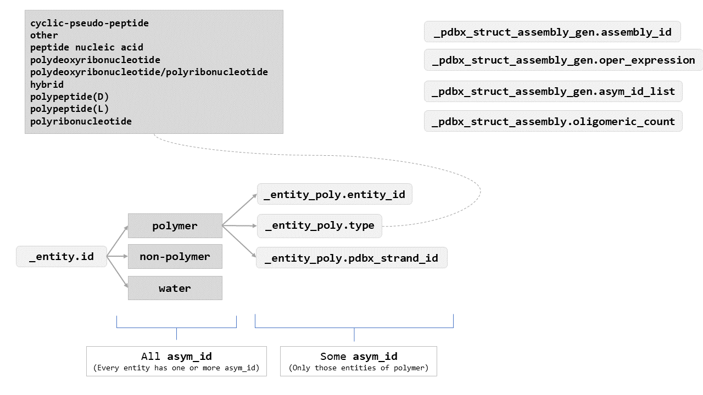
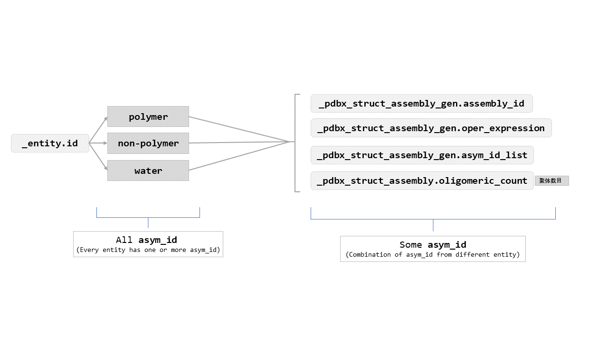

# Relationship Between Biological Assembly and Asymmetric Unit in mmCIF Format Files

_09 Sep 2019_

### Key Concepts

#### Asymmetric Unit

> The asymmetric unit is the smallest portion of a crystal structure to which symmetry operations can be applied in order to generate the complete unit cell (the crystal repeating unit). Symmetry operations most common to crystals of biological macromolecules are rotations, translations and screw axes (combinations of rotation and translation).A crystal asymmetric unit may contain:[1]

> * one biological assembly
> * a portion of a biological assembly
> * multiple biological assemblies


#### Biological Assembly

> The biological assembly (also sometimes referred to as the biological unit) is the macromolecular assembly that has either been shown to be or is believed to be the functional form of the molecule. For example, the functional form of hemoglobin has four chains.

>Depending on the particular crystal structure, symmetry operations consisting of rotations, translations or their combinations may need to be performed in order to obtain the complete biological assembly. Alternately, a subset of the deposited coordinates may need to be selected to represent the biological assembly. Thus, a biological assembly may be built from: [1]

> * __one copy of__ the asymmetric unit
> * __multiple copies of__ the asymmetric unit
> * __a portion of__ the asymmetric unit

### Related items in mmCIF Format

|Key|Category Description
-|-
|```_entity.id```|One concept on which the PDBx/mmCIF format relies is that of entities. An entity is a chemically distinct part of a structure as represented in the PDBx/mmCIF data file. Data items in the ```_entity``` category, describe the chemistry and identity of the molecules under investigation. In any particular entry, there may be multiple copies of a given entity.[2] [More Details](http://mmcif.rcsb.org/dictionaries/mmcif_pdbx_v50.dic/Categories/entity.html "Link")|
|```_entity_poly.entity_id, _entity_poly.pdbx_strand_id, _entity_poly.type```|Data items in the ```ENTITY_POLY``` category record details about the polymer, such as the type of the polymer.[3]|
|```_pdbx_struct_assembly_gen.assembly_id, _pdbx_struct_assembly_gen.oper_expression, _pdbx_struct_assembly_gen.asym_id_list```| Data items in the ```PDBX_STRUCT_ASSEMBLY_GEN``` category record details about the generation of each macromolecular assemblies. The ```PDBX_STRUCT_ASSEMBLY_GEN``` data items provide the specifications of the components that constitute that assembly in terms of cartesian transformations.[3]|
|```_pdbx_struct_assembly.oligomeric_count```|Data items in the ```PDBX_STRUCT_ASSEMBLY``` category record details about the structural elements that form macromolecular assemblies.[3]|

#### Explanation

<table>
    <tr>
        <td>
            The hierarchical frameworks of <b>asym_id</b>s (fig 1)
        </td>
        <td>
          The distribution of <b>asym_id</b>s in biological assemblies (fig 2)
        </td>
    </tr>
    <tr>
        <td>
            
        </td>
        <td>
            
        </td>
    </tr>
</table>

### Examples

#### One copy of the asymmetric unit

__2ZQT__

<table>
    <tr>
        <td>
            The <b>asymmetric unit</b> of PDB ID <a href="http://www.rcsb.org/pdb/explore.do?structureId=2zqt">2zqt</a>
        </td>
        <td>
            The <b>biological assembly</b> of PDB ID <a href="http://www.rcsb.org/pdb/explore.do?structureId=2zqt">2zqt</a>
        </td>
    </tr>
    <tr>
        <td>
            
        </td>
        <td>
            
        </td>
    </tr>
</table>

```c
pdb_id                                                                                    2zqt
_entity.id                                                                        [1, 2, 3, 4]
_entity_poly.entity_id                                                                     [1]
_entity_poly.pdbx_strand_id                                                                [A]
_entity_poly.type                                                             [polypeptide(L)]
_pdbx_struct_assembly_gen.assembly_id                                                      [1]
_pdbx_struct_assembly_gen.oper_expression                                                  [1]
_pdbx_struct_assembly_gen.asym_id_list                                               [A,B,C,D]
_pdbx_struct_assembly.oligomeric_count                                                     [1]
```

```_pdbx_struct_assembly_gen.asym_id_list``` $\Rightarrow$ \[A,~~B,C,D]~~

---

__6IWG__

<table>
    <tr>
        <td>
            The <b>asymmetric unit</b> of PDB ID <a href="http://www.rcsb.org/pdb/explore.do?structureId=6iwg">6iwg</a>
        </td>
        <td>
            The <b>biological assembly</b> of PDB ID <a href="http://www.rcsb.org/pdb/explore.do?structureId=6iwg">6iwg</a>
        </td>
    </tr>
    <tr>
        <td>
            
        </td>
        <td>
            
        </td>
    </tr>
</table>

```c
pdb_id                                                                                    6iwg
_entity.id                                                               [1, 2, 3, 4, 5, 6, 7]
_entity_poly.entity_id                                                               [1, 2, 3]
_entity_poly.pdbx_strand_id                                                          [A, B, C]
_entity_poly.type                             [polypeptide(L), polypeptide(L), polypeptide(L)]
_pdbx_struct_assembly_gen.assembly_id                                                      [1]
_pdbx_struct_assembly_gen.oper_expression                                                  [1]
_pdbx_struct_assembly_gen.asym_id_list       [A,B,C,D,E,F,G,H,I,J,K,L,M,N,O,P,Q,R,S,T,U,V,W...
_pdbx_struct_assembly.oligomeric_count                                                     [3]
```

`_pdbx_struct_assembly_gen.asym_id_list` $\Rightarrow$ [A,B,C,~~D,E,F,G,H,I,J,K,L,M,N,O,P,Q,R,S,T,U,V,W~~...

---

#### Multiple copies of the asymmetric unit

__1HHO__

<table>
    <tr>
        <td>
            The <b>asymmetric unit</b> of PDB ID <a href="http://www.rcsb.org/pdb/explore.do?structureId=1hho">1hho</a>
        </td>
        <td>
            The <b>biological assembly</b> of PDB ID <a href="http://www.rcsb.org/pdb/explore.do?structureId=1hho">1hho</a>
        </td>
    </tr>
    <tr>
        <td>
            
        </td>
        <td>
            
        </td>
    </tr>
</table>

```c
pdb_id                                                                                    1hho
_entity.id                                                                  [1, 2, 3, 4, 5, 6]
_entity_poly.entity_id                                                                  [1, 2]
_entity_poly.pdbx_strand_id                                                             [A, B]
_entity_poly.type                                             [polypeptide(L), polypeptide(L)]
_pdbx_struct_assembly_gen.assembly_id                                                      [1]
_pdbx_struct_assembly_gen.oper_expression                                                [1,2]
_pdbx_struct_assembly_gen.asym_id_list                                     [A,B,C,D,E,F,G,H,I]
_pdbx_struct_assembly.oligomeric_count                                                     [4]
```

```_pdbx_struct_assembly_gen.asym_id_list``` $\Rightarrow$ \[A,B,~~C,D,E,F,G,H,I~~] $* 2$

---

__2AKE__

<table>
    <tr>
        <td>
            The <b>asymmetric unit</b> of PDB ID <a href="http://www.rcsb.org/pdb/explore.do?structureId=2ake">2ake</a>
        </td>
        <td>
            The <b>biological assembly</b> of PDB ID <a href="http://www.rcsb.org/pdb/explore.do?structureId=2ake">2ake</a>
        </td>
    </tr>
    <tr>
        <td>
            
        </td>
        <td>
            
        </td>
    </tr>
</table>

```c
pdb_id                                                                                    2ake
_entity.id                                                                        [1, 2, 3, 4]
_entity_poly.entity_id                                                                  [1, 2]
_entity_poly.pdbx_strand_id                                                             [B, A]
_entity_poly.type                                         [polyribonucleotide, polypeptide(L)]
_pdbx_struct_assembly_gen.assembly_id                                                      [1]
_pdbx_struct_assembly_gen.oper_expression                                                [1,2]
_pdbx_struct_assembly_gen.asym_id_list                                               [A,B,C,D]
_pdbx_struct_assembly.oligomeric_count                                                     [4]
```

```_pdbx_struct_assembly_gen.asym_id_list``` $\Rightarrow$ [A,B,~~C,D~~] $* 2$

---

#### A portion of the asymmetric unit

__2XYN__

<table>
    <tr>
        <td>
            The <b>asymmetric unit</b> of PDB ID <a href="http://www.rcsb.org/pdb/explore.do?structureId=2xyn">2xyn</a>
        </td>
        <td>
            The <b>biological assembly 1</b> of PDB ID <a href="http://www.rcsb.org/pdb/explore.do?structureId=2xyn">2xyn</a>
        </td>
        <td>
            The <b>biological assembly 2</b> of PDB ID <a href="http://www.rcsb.org/pdb/explore.do?structureId=2xyn">2xyn</a>
        </td>
        <td>
            The <b>biological assembly 3</b> of PDB ID <a href="http://www.rcsb.org/pdb/explore.do?structureId=2xyn">2xyn</a>
        </td>
    </tr>
    <tr>
        <td>
            
        </td>
        <td>
            
        </td>
        <td>
            
        </td>
        <td>
            
        </td>
    </tr>
</table>

```c
pdb_id                                                                                    2xyn
_entity.id                                                                     [1, 2, 3, 4, 5]
_entity_poly.entity_id                                                                     [1]
_entity_poly.pdbx_strand_id                                                            [A,B,C]
_entity_poly.type                                                             [polypeptide(L)]
_pdbx_struct_assembly_gen.assembly_id                                                [1, 2, 3]
_pdbx_struct_assembly_gen.oper_expression                                            [1, 1, 1]
_pdbx_struct_assembly_gen.asym_id_list                       [A,D,E,F,G,N, B,H,I,J,O, C,K,L,M]
_pdbx_struct_assembly.oligomeric_count                                               [1, 1, 1]
```

`_pdbx_struct_assembly_gen.asym_id_list` $\Rightarrow$ [A,~~D,E,F,G,N,~~ B,~~H,I,J,O,~~ C,~~K,L,M~~]

---

__3A6P__

<table>
    <tr>
        <td>
            The <b>asymmetric unit</b> of PDB ID <a href="http://www.rcsb.org/pdb/explore.do?structureId=3a6p">3a6p</a>
        </td>
        <td>
            The <b>biological assembly 1</b> of PDB ID <a href="http://www.rcsb.org/pdb/explore.do?structureId=3a6p">3a6p</a>
        </td>
        <td>
            The <b>biological assembly 2</b> of PDB ID <a href="http://www.rcsb.org/pdb/explore.do?structureId=3a6p">3a6p</a>
        </td>
    </tr>
    <tr>
        <td>
            
        </td>
        <td>
            
        </td>
        <td>
            
        </td>
    </tr>
</table>

```c
pdb_id                                                                                    3a6p
_entity.id                                                               [1, 2, 3, 4, 5, 6, 7]
_entity_poly.entity_id                                                         [1, 2, 3, 4, 5]
_entity_poly.pdbx_strand_id                                          [A,F, B,G, C,H, D,I, E,J]
_entity_poly.type                            [polypeptide(L), polypeptide(L), polypeptide(L)...
_pdbx_struct_assembly_gen.assembly_id                                                   [1, 2]
_pdbx_struct_assembly_gen.oper_expression                                               [1, 1]
_pdbx_struct_assembly_gen.asym_id_list                          [A,B,C,D,E,K,L, F,G,H,I,J,M,N]
_pdbx_struct_assembly.oligomeric_count                                                  [5, 5]
```

`_pdbx_struct_assembly_gen.asym_id_list` $\Rightarrow$ [A,B,C,D,E,~~K,L,~~ F,G,H,I,J,~~M,N~~]

---

#### Special

##### a portion of the asymmetric unit, (a portion of the asymmetric unit + multiple copies of the asymmetric unit)

__1DFV__

<table>
    <tr>
        <td>
            The <b>asymmetric unit</b> of PDB ID <a href="http://www.rcsb.org/pdb/explore.do?structureId=1dfv">1dfv</a>
        </td>
        <td>
            The <b>biological assembly 1</b> of PDB ID <a href="http://www.rcsb.org/pdb/explore.do?structureId=1dfv">1dfv</a>
        </td>
        <td>
            The <b>biological assembly 2</b> of PDB ID <a href="http://www.rcsb.org/pdb/explore.do?structureId=1dfv">1dfv</a>
        </td>
        <td>
            The <b>biological assembly 3</b> of PDB ID <a href="http://www.rcsb.org/pdb/explore.do?structureId=1dfv">1dfv</a>
        </td>
    </tr>
    <tr>
        <td>
            
        </td>
        <td>
            
        </td>
        <td>
            
        </td>
        <td>
            
        </td>
    </tr>
</table>

```c
pdb_id                                                                                    1dfv
_entity.id                                                                     [1, 2, 3, 4, 5]
_entity_poly.entity_id                                                                     [1]
_entity_poly.pdbx_strand_id                                                              [A,B]
_entity_poly.type                                                             [polypeptide(L)]
_pdbx_struct_assembly_gen.assembly_id                                                [1, 2, 3]
_pdbx_struct_assembly_gen.oper_expression                                          [1, 1, 1,2]
_pdbx_struct_assembly_gen.asym_id_list                         [A,C,D,E,F,I, B,G,H,J, B,G,H,J]
_pdbx_struct_assembly.oligomeric_count                                               [1, 1, 2]
```

`_pdbx_struct_assembly_gen.asym_id_list` $\Rightarrow$ [A,~~C,D,E,F,I,~~ B,~~G,H,J,~~ B,~~G,H,J~~]

* BioUnit1: A,~~C,D,E,F,I,~~ $\rightarrow * 1$
* BioUnit2: B,~~G,H,J,~~ $\rightarrow * 1$
* BioUnit3: B,~~G,H,J,~~$\rightarrow * 2$

---

##### a portion of the asymmetric unit + multiple copies of the asymmetric unit

__3HL2__

<table>
    <tr>
        <td>
            The <b>asymmetric unit</b> of PDB ID <a href="http://www.rcsb.org/pdb/explore.do?structureId=3hl2">3hl2</a>
        </td>
        <td>
            The <b>biological assembly 1</b> of PDB ID <a href="http://www.rcsb.org/pdb/explore.do?structureId=3hl2">3hl2</a>
        </td>
        <td>
            The <b>biological assembly 2</b> of PDB ID <a href="http://www.rcsb.org/pdb/explore.do?structureId=3hl2">3hl2</a>
        </td>
    </tr>
    <tr>
        <td>
            
        </td>
        <td>
            
        </td>
        <td>
            
        </td>
    </tr>
</table>

```c
pdb_id                                                                                    3hl2
_entity.id                                                                  [1, 2, 3, 4, 5, 6]
_entity_poly.entity_id                                                                  [1, 2]
_entity_poly.pdbx_strand_id                                                       [A,B,C,D, E]
_entity_poly.type                                         [polypeptide(L), polyribonucleotide]
_pdbx_struct_assembly_gen.assembly_id                                             [1, 1, 2, 2]
_pdbx_struct_assembly_gen.oper_expression                                         [1, 2, 3, 2]
_pdbx_struct_assembly_gen.asym_id_list       [A,B,F,G,H,I,J,K,Q,R, A,B,E,F,G,H,I,J,K,Q,R,U, C,D,L,M,N,O,P,S,T, C,D,E,L,M,N,O,P,S,T,U]
_pdbx_struct_assembly.oligomeric_count                                                  [5, 5]
```

`_pdbx_struct_assembly_gen.asym_id_list` $\Rightarrow$ [A,B,~~F,G,H,I,J,K,Q,R,~~ A,B,E,~~F,G,H,I,J,K,Q,R,U,~~ C,D,~~L,M,N,O,P,S,T,~~ C,D,E,~~L,M,N,O,P,S,T,U~~]

* BioUnit1: A,B,~~F,G,H,I,J,K,Q,R,~~ $+$ A,B,E,~~F,G,H,I,J,K,Q,R,U,~~
* BioUnit2: C,D,~~L,M,N,O,P,S,T,~~ $+$ C,D,E,~~L,M,N,O,P,S,T,U~~

---

### Reference

<ol>
    <li>http://pdb101.rcsb.org/learn/guide-to-understanding-pdb-data/biological-assemblies#Anchor-BioUnit</li>
    <li>https://pdb101.rcsb.org/learn/guide-to-understanding-pdb-data/beginner%E2%80%99s-guide-to-pdb-structures-and-the-pdbx-mmcif-format</li>
    <li>http://mmcif.rcsb.org/pdbx-mmcif-home-page.html</li>
    <li>http://proteopedia.org/wiki/index.php/Biological_Unit</li>
</ol>


[💨back](../blog.html)