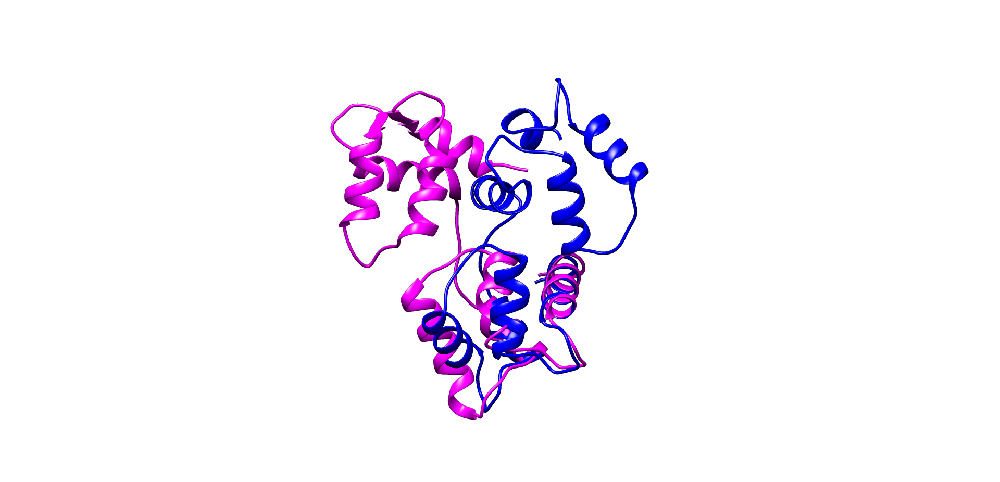

# Feactures of Mapping Between RefSeq and UniProt

_21 Aug 2019_

## Example

Gene | RefSeq Protein | RefSeq Nucleotide | (UniProt) Entry | Gene names | Idencial Sequences | isoform | PDB
-|-|-|-|-|-|-|-
NOTCH2NL | NP_982283 | NM_203458 | {P0DPK4,Q7Z3S9} | {NOTCH2NLC, (NOTCH2NLA N2N, NOTCH2NL)} | True | {False,True} |{False, False}
CALM2 | NP_001734	| NM_001743 | {P0DP23,P0DP24,P0DP25} | {CALM1, CALM2, CALM3} | True | {False,False,False} | {True,True,True}
ECE2 | NP_001032401	| NM_001037324 | {P0DPD6,P0DPD8} | {ECE2,EEF1AKMT4-ECE2} | False | {True,True(Reference:P0DPD6)} | {False,False}
C4B | NP_001002029	| NM_001002029 | {P0C0L4,P0C0L5} | {C4A,C4B} | False | {True,False} | {True, True}

### Alignment (e.g)

```clustal
sp|P0C0L4|CO4A_HUMAN      FVLKVLSLAQEQVGGSPEKLQETSNWLLSQQQADGSFQDPCPVLDRSMQGGLVGNDETVA
sp|P0C0L5|CO4B_HUMAN      FVLKVLSLAQEQVGGSPEKLQETSNWLLSQQQADGSFQDLSPVIHRSMQGGLVGNDETVA
NP_001002029              FVLKVLSLAQEQVGGSPEKLQETSNWLLSQQQADGSFQDLSPVIHRSMQGGLVGNDETVA
                          *************************************** .**:.***************
```

---

Superimpose Figure (5WSV_A_with_4LZX_A):



```clustal
4LZX:A|PDBID|CHAIN|SEQUENCE      -----ADQLTEEQIAEFKEAFSLFDKDGDGTITTKELGTVMRSLGQNPTEAELQDMINEV
sp|P0DP24|CALM2_HUMAN            ----MADQLTEEQIAEFKEAFSLFDKDGDGTITTKELGTVMRSLGQNPTEAELQDMINEV
5WSV:A|PDBID|CHAIN|SEQUENCE      GPGSMADQLTEEQIAEFKEAFSLFDKDGDGTITTKELGTVMRSLGQNPTEAELQDMINEV
                                      *******************************************************

4LZX:A|PDBID|CHAIN|SEQUENCE      DADGNGTIDFPEFLTMMARKMKDTDSEEEIREAFRVFDKDGNGYISAAELRHVMTNLGEK
sp|P0DP24|CALM2_HUMAN            DADGNGTIDFPEFLTMMARKMKDTDSEEEIREAFRVFDKDGNGYISAAELRHVMTNLGEK
5WSV:A|PDBID|CHAIN|SEQUENCE      DADGNGTIDFPEFLTMMARKMKDTDSEEEIREAFRVFDKDGNGYISAAELRHVMTNLGEK
                                 ************************************************************

4LZX:A|PDBID|CHAIN|SEQUENCE      LTDEEVDEMIREADIDGDGQVNYEEFVQMMTAK
sp|P0DP24|CALM2_HUMAN            LTDEEVDEMIREADIDGDGQVNYEEFVQMMTAK
5WSV:A|PDBID|CHAIN|SEQUENCE      LTDEEVDEMIREADIDGDGQVNYEEFVQMMT--
                                 ******************************* 
```
